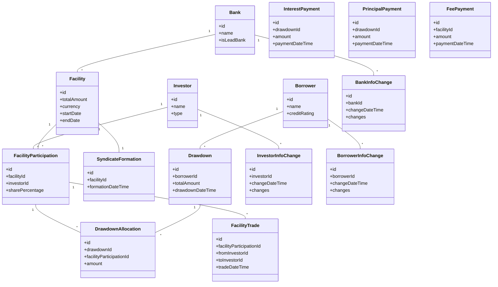

```mermaid
classDiagram
    class Investor {
        +id
        +name
        +type
    }

    class Borrower {
        +id
        +name
        +creditRating
    }

    class Bank {
        +id
        +name
        +isLeadBank
    }

    class Facility {
        +id
        +totalAmount
        +currency
        +startDate
        +endDate
    }

    class FacilityParticipation {
        +id
        +facilityId
        +investorId
        +sharePercentage
    }

    class DrawdownAllocation {
        +id
        +drawdownId
        +facilityParticipationId
        +amount
    }

    %% イベントエンティティ
    class SyndicateFormation {
        +id
        +facilityId
        +formationDateTime
    }

    class Drawdown {
        +id
        +borrowerId
        +totalAmount
        +drawdownDateTime
    }

    class InterestPayment {
        +id
        +drawdownId
        +amount
        +paymentDateTime
    }

    class PrincipalPayment {
        +id
        +drawdownId
        +amount
        +paymentDateTime
    }

    class FeePayment {
        +id
        +facilityId
        +amount
        +paymentDateTime
    }

    class FacilityTrade {
        +id
        +facilityParticipationId
        +fromInvestorId
        +toInvestorId
        +tradeDateTime
    }

    class InvestorInfoChange {
        +id
        +investorId
        +changeDateTime
        +changes
    }

    class BorrowerInfoChange {
        +id
        +borrowerId
        +changeDateTime
        +changes
    }

    class BankInfoChange {
        +id
        +bankId
        +changeDateTime
        +changes
    }

    Investor "1" -- "*" FacilityParticipation
    Facility "1" -- "*" FacilityParticipation
    FacilityParticipation "1" -- "*" DrawdownAllocation
    Drawdown "1" -- "*" DrawdownAllocation
    
    Borrower "1" -- "*" Drawdown
    Bank "1" -- "*" Facility
    
    Facility "1" -- "1" SyndicateFormation
    FacilityParticipation "1" -- "*" FacilityTrade
    Investor "1" -- "*" InvestorInfoChange
    Borrower "1" -- "*" BorrowerInfoChange
    Bank "1" -- "*" BankInfoChange
```